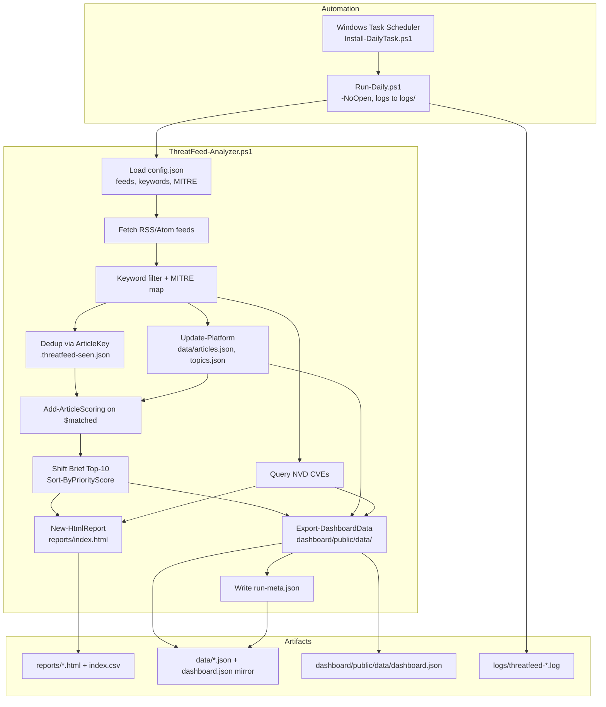
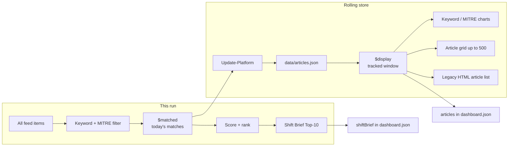
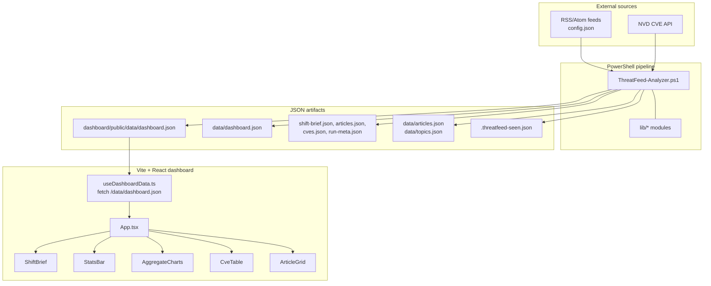
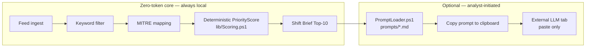
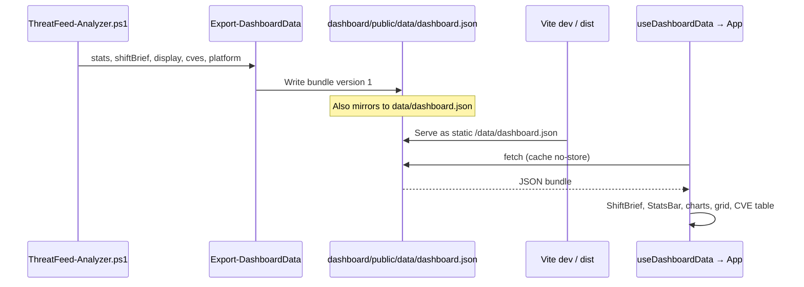
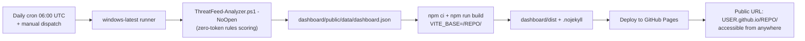
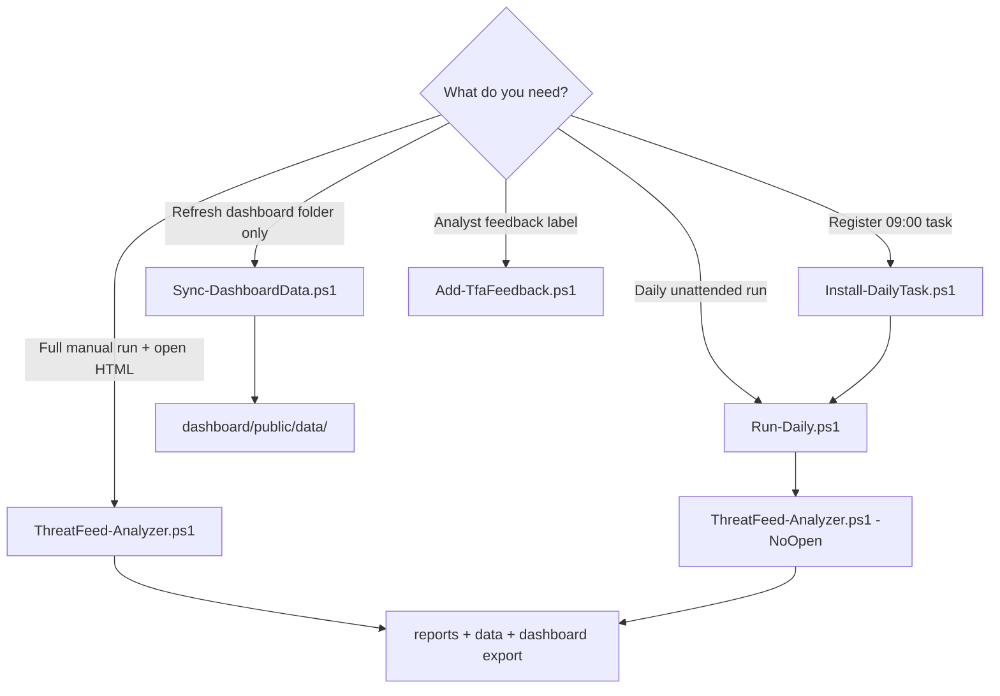

# ThreatFeed / Samaa — Platform Flow

**Project:** `d:\Samaa`  
**Product:** ThreatFeed Analyzer (Samaa)  
**Purpose:** Flow-centric guide — how data moves and how analysts use the platform each day.

For architecture deep dives, scoring tables, config reference, and troubleshooting, see **[PLATFORM-GUIDE.md](./PLATFORM-GUIDE.md)**.

---

## Table of contents

1. [What happens in one sentence](#1-what-happens-in-one-sentence)
2. [End-to-end daily run](#2-end-to-end-daily-run)
3. [The `$matched` vs `$display` split](#3-the-matched-vs-display-split)
4. [Data flow: feeds to React UI](#4-data-flow-feeds-to-react-ui)
5. [Analyst morning journey](#5-analyst-morning-journey)
6. [Zero-token design and optional AI](#6-zero-token-design-and-optional-ai)
7. [Static JSON dashboard contract](#7-static-json-dashboard-contract)
8. [Deployment flow: local to hosted](#8-deployment-flow-local-to-hosted)
9. [Supporting scripts and when to use them](#9-supporting-scripts-and-when-to-use-them)
10. [Quick reference](#10-quick-reference)

---

## 1. What happens in one sentence

Every run, PowerShell pulls RSS/Atom feeds, keeps articles that match your keywords, scores **today’s matches** into a **Shift Brief (Top 10)**, enriches with NVD CVEs and a rolling article store, then writes HTML reports plus a **static `dashboard.json`** that a Vite + React app reads — no backend, no paid TI APIs, no LLM tokens for ranking.

---

## 2. End-to-end daily run

Most teams automate this with Windows Task Scheduler. The unattended path uses `Run-Daily.ps1`, which calls `ThreatFeed-Analyzer.ps1` with `-NoOpen` so no browser pops up on the server.



**In plain language:** the scheduler wakes up the wrapper, the wrapper runs the main analyzer without opening a window, and the analyzer produces reports, JSON data, and dashboard bundle files in one pass.

### Technical detail

| Step | Script / module | Output |
|------|-----------------|--------|
| Config | `ThreatFeed-Analyzer.ps1` | `$Feeds`, `$Keywords`, `$Mitre` from `config.json` |
| Fetch | inline + `TextEncoding.ps1` | `$allItems` (raw feed items) |
| Filter | keyword regex + MITRE patterns | **`$matched`** (this run only) |
| Dedup | `lib/ArticleKey.ps1` | `$new`, updates `.threatfeed-seen.json` |
| Platform | `Update-Platform` | **`$display`** source: rolling `data/articles.json` |
| Score | `lib/Scoring.ps1` | `PriorityScore`, `ReasonChips` on **`$matched`** |
| Shift Brief | `Sort-ByPriorityScore` | Top 10 from **`$matched`**, not `$display` |
| Export | `lib/DashboardExport.ps1` | `dashboard.json` v1 + split debug files |
| Wrapper | `Run-Daily.ps1` | transcript log, prunes logs older than 30 days |

If all feeds fail, the analyzer exits with code **1** (so the scheduled task can surface failure).

---

## 3. The `$matched` vs `$display` split

This is the most important design decision in the pipeline. Two article lists exist for two different jobs.



| Variable | What it contains | Used for |
|----------|------------------|----------|
| **`$matched`** | Articles matching keywords **in this run** | Shift Brief scoring, Top-10 selection, stats `matched` |
| **`$display`** | Rolling tracked articles from `Update-Platform` | Full article grid, aggregate charts, CSV, legacy HTML list |

**Why split them?** Scoring the rolling window would keep surfacing stale high-score articles from prior days. The Shift Brief must answer *“what matters for **this** shift?”* — only current-run matches. Charts and the article grid use `$display` so the UI still has context on quiet days when today’s feed volume is low.

From the codebase:

```powershell
# Score today's keyword matches for Shift Brief (uses $matched, not rolling $display)
foreach ($item in $matched) {
    $scoredMatched.Add((Add-ArticleScoring -Article $item -Tracking $platform.Tracking ...))
}
$shiftBrief = @($sortedAll | Select-Object -First 10)
```

---

## 4. Data flow: feeds to React UI

The hosted dashboard is a **static site**. It does not call PowerShell or any API at runtime — it only `fetch`es JSON files baked into `public/data/`.



**In plain language:** feeds and CVEs go in; JSON comes out; the React app reads that JSON and renders sections. Refresh the page after a pipeline run to see new data.

### Technical detail

- **`Export-DashboardData`** (`lib/DashboardExport.ps1`) writes schema **version 1** bundle: `stats`, `shiftBrief`, `articles` (max 500), `aggregates`, `tracking`, `cves` (max 150 in bundle; full count in stats).
- **`Sync-DashboardData.ps1`** copies `data/dashboard.json` → `dashboard/public/data/` or rebuilds a reduced bundle from `articles.json` + `run-meta.json` if the full export is missing.
- React loads with `cache: 'no-store'` so dev refresh picks up the latest file without aggressive browser caching.

---

## 5. Analyst morning journey

This is the human flow the platform is built around: ~15 minutes to know what to read first.

```mermaid
flowchart TD
  Start([Analyst starts shift]) --> Auto{Scheduled run<br/>already finished?}

  Auto -->|Yes| Open[Open dashboard or reports]
  Auto -->|No / manual| Manual[Run ThreatFeed-Analyzer.ps1<br/>or Run-Daily.ps1]

  Manual --> Open

  Open --> UI{Which UI?}
  UI -->|Browser| Dash[localhost:5173 or hosted URL<br/>React dashboard]
  UI -->|File / email| HTML[reports/index.html]

  Dash --> Brief[Read Shift Brief Top-10<br/>highest PriorityScore first]
  HTML --> Brief

  Brief --> Chips{Reason chips?}
  Chips -->|NEW| New[First time seen — prioritize]
  Chips -->|TREND-UP| Trend[Topic heating up in topics.json]
  Chips -->|RESEARCH / OFFICIAL| Tier[Higher source tier in score]

  Brief --> Deep{Need deeper analysis?}
  Deep -->|Quick scan| Grid[Search article grid / CVE table]
  Deep -->|AI assist| Prompt[Copy prompt from HTML report<br/>ChatGPT / Claude / Gemini paste-only]
  Deep -->|Label for later| Feedback[Add-TfaFeedback.ps1<br/>up | down | acted | skip]

  Grid --> Act([Act on intel / tickets / hunts])
  Prompt --> Act
  Feedback --> Act
```

**Suggested routine**

1. Open the Shift Brief — start at rank #1, work down.
2. Scan reason chips (`NEW`, `TREND-UP`, `RESEARCH`, `3xMITRE`, etc.).
3. Use the article grid and CVE table for context (fed by **`$display`**, not the brief).
4. Optionally copy an AI prompt from the legacy HTML report (out-of-band, analyst-controlled).
5. Log feedback with the article `key` (40-char SHA1) for the future learning loop.

---

## 6. Zero-token design and optional AI



**Zero-token** means ranking never calls OpenAI, Claude, Gemini, or commercial TI APIs. `Get-PriorityScore` sums fixed rules (source tier, keyword hits, MITRE count, novelty, topic trend) and clamps to 0–100.

**No AI in the hosted product.** The React dashboard and the autonomous CI pipeline contain
no LLM, no Ollama, and no API calls — by design. The only AI surface is a set of manual
copy-paste prompt templates in `prompts/` embedded in the **legacy** `reports/index.html`
(loaded by `PromptLoader.ps1`); these are not part of the hosted dashboard. A local LLM
(chat/summarize) was considered and explicitly deferred — it cannot serve a public,
static GitHub Pages site, so it is out of scope.

### Technical detail — PriorityScore inputs

| Signal | Effect |
|--------|--------|
| Source tier | Research +12, Official +8, News/default +4 |
| Keyword hits | +3 each, cap +15 |
| MITRE mappings | +4 each, cap +12 |
| Novelty | +10 if article key not in seen set |
| Topic trend | up +6, down +3, flat +0 (from `data/topics.json`) |

Feedback priors (`up` / `down` / `acted`) are captured in `data/feedback.jsonl` but **not applied in B-Seed scoring yet** (planned for B-Core).

---

## 7. Static JSON dashboard contract



The React app reads **`dashboard.json` only** at runtime. Split files (`shift-brief.json`, etc.) exist for debugging and sync; components do not fetch them individually.

**Key fields analysts see**

| UI section | JSON path |
|------------|-----------|
| Header / stats bar | `stats`, `runMeta` |
| Shift Brief | `shiftBrief[]` with `priorityScore`, `reasonChips`, `key` |
| Keyword / MITRE charts | `aggregates.keywords`, `aggregates.mitre` |
| CVE table | `cves[]` (slice); `stats.cveCount` for total |
| Article grid | `articles[]` (up to 500 tracked items) |

---

## 8. Deployment flow: autonomous cloud refresh

The hosted dashboard updates **itself** with no PC required. GitHub Actions runs the
PowerShell pipeline on a daily cron, builds the dashboard, and publishes the built UI
to GitHub Pages. Only the built UI is served publicly; the pipeline runs inside CI.



Workflow: [.github/workflows/deploy.yml](../.github/workflows/deploy.yml). Triggers are
the daily `schedule`, manual `workflow_dispatch`, and `push` to `main` touching the
dashboard or pipeline. A `concurrency` guard ensures only the latest deploy wins.

**Typical paths**

| Environment | How analysts view results |
|-------------|---------------------------|
| **Hosted (autonomous)** | GitHub Actions cron rebuilds + deploys to `USER.github.io/REPO/` daily |
| **Local dev** | `npm run dev` → http://localhost:5173 |
| **Local preview** | `npm run build` + `npm run preview` → http://localhost:4173 |
| **Optional Vercel** | Deploy `dashboard/dist`; root directory `dashboard` (config retained) |
| **No Node** | Open `reports/index.html` from shared folder |

**Why no data commit:** each CI run regenerates `dashboard.json` and bakes it into the
deployed `dist`, so the published artifact is always the source of truth — no committed
data drift. The base path is set from the repo name via `VITE_BASE` (see
[dashboard/vite.config.ts](../dashboard/vite.config.ts)); the data fetch already uses
`import.meta.env.BASE_URL`, so it adapts automatically.

For Vercel settings and the manual refresh fallback, see [PLATFORM-GUIDE §7 — Deploying the hosted dashboard](./PLATFORM-GUIDE.md#7-deploying-the-hosted-dashboard).

---

## 9. Supporting scripts and when to use them



| Script | Role in the flow |
|--------|------------------|
| `ThreatFeed-Analyzer.ps1` | Main pipeline — ingest, score, export |
| `Run-Daily.ps1` | Scheduler-safe wrapper, logging, `-NoOpen` |
| `Install-DailyTask.ps1` | Creates/removes Windows scheduled task |
| `Sync-DashboardData.ps1` | Copy or rebuild JSON for Vite without full re-run |
| `Add-TfaFeedback.ps1` | Append-only labels to `data/feedback.jsonl` |

---

## 10. Quick reference

### One manual run + dashboard

```powershell
cd d:\Samaa
.\ThreatFeed-Analyzer.ps1
cd dashboard
npm run dev
# http://localhost:5173
```

### After pipeline run, sync only

```powershell
.\Sync-DashboardData.ps1
```

### Decision checklist

| Question | Answer in this platform |
|----------|-------------------------|
| What should I read first today? | **Shift Brief** — scored from **`$matched`** |
| Why does the grid show more than 10 articles? | Grid uses **`$display`** rolling store |
| Does ranking cost API tokens? | **No** — deterministic PowerShell math |
| How does the React app get data? | Static **`dashboard.json`** — no backend |
| Where is dedup state? | `.threatfeed-seen.json` + `ArticleKey` |
| Where is topic trend for scoring? | `Update-Platform` → `data/topics.json` |

---

**Further reading:** [PLATFORM-GUIDE.md](./PLATFORM-GUIDE.md) — executive summary, repository map, scoring tables, testing, config reference, troubleshooting.
