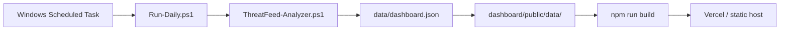
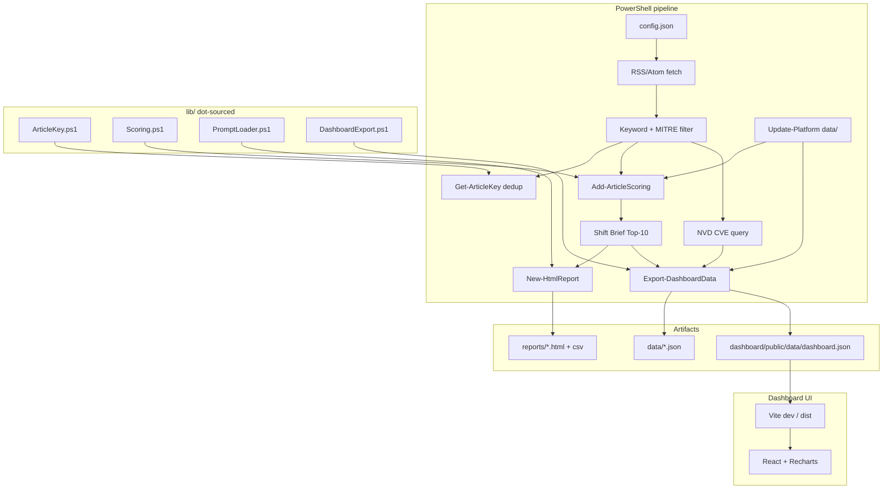

# ThreatFeed Analyzer — Platform Guide

**Project folder:** `d:\Samaa`  
**Product name:** ThreatFeed Analyzer (also referred to as *Samaa* in planning sessions)  
**Last verified:** 2026-05-31  
**Status:** B-Seed shipped — PowerShell pipeline, hosted React dashboard, Pester tests

---

## Table of contents

1. [Executive summary](#1-executive-summary)
2. [Who this is for and what problem it solves](#2-who-this-is-for-and-what-problem-it-solves)
3. [The journey: from idea to working platform](#3-the-journey-from-idea-to-working-platform)
4. [What users see today](#4-what-users-see-today)
5. [Day-to-day use for SOC teammates](#5-day-to-day-use-for-soc-teammates)
6. [Running and viewing the dashboard locally](#6-running-and-viewing-the-dashboard-locally)
7. [Deploying the hosted dashboard](#7-deploying-the-hosted-dashboard)
8. [Architecture](#8-architecture)
9. [Repository structure](#9-repository-structure)
10. [B-Seed components (technical deep dive)](#10-b-seed-components-technical-deep-dive)
11. [Scoring formula and Shift Brief logic](#11-scoring-formula-and-shift-brief-logic)
12. [Hosted dashboard stack and data contract](#12-hosted-dashboard-stack-and-data-contract)
13. [Testing](#13-testing)
14. [Daily automation and operations](#14-daily-automation-and-operations)
15. [Engineering review decisions (D1–D4)](#15-engineering-review-decisions-d1d4)
16. [Roadmap and deferred work](#16-roadmap-and-deferred-work)
17. [Configuration reference](#17-configuration-reference)
18. [Troubleshooting](#18-troubleshooting)
19. [Related documents](#19-related-documents)

---

## 1. Executive summary

ThreatFeed Analyzer is a **local, zero-token threat-intelligence briefing system** for small security operations teams. It pulls cybersecurity news from dozens of RSS/Atom feeds, keeps only articles that match your keywords, maps them to MITRE ATT&CK techniques, enriches the run with NVD CVE data, ranks the most important items into a **Shift Brief (Top 10)**, and presents everything in both a legacy HTML report and a modern **Vite + React dashboard**.

The platform deliberately avoids paid threat-intelligence APIs and cloud LLM calls for triage. Ranking is deterministic PowerShell math. When analysts want deeper analysis, one-click buttons copy structured prompts into ChatGPT, Claude, or Gemini — paste-only, out of band.

This guide explains the full arc of the project for **non-technical stakeholders** (what it is, why it exists, how teams use it) and **engineers** (architecture, modules, scoring, tests, deployment).

---

## 2. Who this is for and what problem it solves

### Audience

ThreatFeed targets **small SOC teams (roughly 2–10 analysts)** who:

- Start each shift drowning in security news, vendor blogs, and CVE noise
- Cannot justify commercial threat-intelligence platforms (Recorded Future, etc.)
- Do not want to operate a full MISP/OpenCTI stack just to answer “what should I read first?”
- Already use Windows and PowerShell in their environment

### The problem

At shift start, analysts face **attention overload**: hundreds of headlines, duplicate stories across feeds, and no trusted ordering layer. Generic RSS readers do not understand your hunt keywords, MITRE mappings, or what you already saw yesterday. Pasting everything into an LLM burns tokens and still requires manual curation.

### The wedge

ThreatFeed is positioned as a **pre-platform morning router**, not a replacement for MISP or OpenCTI. It answers one question well: *“What are the top ten things my team should look at in the next fifteen minutes?”* — for **$0 in API tokens**.

---

## 3. The journey: from idea to working platform

The build followed a structured product and engineering path across a single intensive session (2026-05-31).

### Phase 1 — Office hours (brainstorming)

Using gstack **Office Hours** in builder mode, the team framed the vision:

| Decision | Choice | Meaning |
|----------|--------|---------|
| **D1 — Goal** | Open source / research | Optimize for craft, forkability, and learning — not enterprise sales |
| **D2 — North star** | Autonomous SOC analyst **+** Prompt OS | Local triage/scoring plus versioned, forkable analyst prompt templates |
| **D3 — Audience** | Small team SOC (2–10) | Polish and trust matter more than multi-tenant RBAC |
| **D4 — Fastest path** | Ship dashboard + daily task to 2–3 teammates this week | Real usage before GitHub polish or ML |
| **D5 — Closest competitor** | OSS MISP/OpenCTI/TheHive | ThreatFeed is the *morning brief*, not the platform |
| **D6 — 10× vision** | Local ML for zero-token triage | ONNX/heuristic scorer later; Week 1 uses pure PowerShell heuristics |
| **D10 — Approach** | Full **Approach B**, phased | B-Seed → B-Core → B-ML |

The approved design document lives at:

`C:\Users\mmoha\.gstack\projects\Samaa\mmoha-unknown-design-20260531-051741.md`

### Phase 2 — Engineering review

**`/plan-eng-review`** locked B-Seed implementation decisions (see [Section 15](#15-engineering-review-decisions-d1d4)). The review produced an ordered task list (T1–T11), a Pester test plan, and deferred items captured in `TODOS.md`.

### Phase 3 — B-Seed implementation

The following shipped in the repo:

- Dot-sourced modules: `ArticleKey`, `Scoring`, `PromptLoader`, `DashboardExport`
- Shift Brief Top-10 with `PriorityScore` and reason chips
- Versioned prompts in `prompts/` with manifest
- Feedback CLI (`Add-TfaFeedback.ps1`)
- Run metadata (`data/run-meta.json`)
- Hosted dashboard (`dashboard/`) exporting `dashboard.json`
- **25 Pester tests**, all passing
- Hardened `Run-Daily.ps1` exit codes

### Phase 4 — Verification (this session)

| Check | Result |
|-------|--------|
| `Sync-DashboardData.ps1` | OK — synced from `data/dashboard.json` |
| `npm run build` (dashboard) | OK — built in ~4s |
| `npm run dev` | OK — **http://localhost:5173/** |
| `npm run preview` | OK — **http://localhost:4173/** |
| Dashboard JSON via HTTP | OK — version 1, 10 Shift Brief items, 31 articles |
| `Invoke-Pester .\tests\` | **25 passed, 0 failed** |

---

## 4. What users see today

Analysts interact with two UIs that read the same underlying data:

### A. Legacy HTML report (`reports/`)

Generated on each run. Opens automatically unless `-NoOpen` is set. Includes:

- Shift Brief (Top 10) with scores and reason chips
- Stat cards, keyword and MITRE charts
- CVE panel (when NVD data is present)
- Article cards with search and AI assistant buttons
- Light/dark theme, glass panels, optional assistant orb

Best for: offline viewing, email attachment, shared network folder.

### B. Hosted React dashboard (`dashboard/`)

Professional SOC-style dark UI, minimal and animated (Framer Motion, reduced-motion aware). Sections:

1. **Header** — brand, live run-health pill (Healthy / Degraded / Errors from feeds OK ratio), relative "updated" time
2. **Stats bar** — animated count-up tiles (feeds OK, fetched, matched, new, tracked, CVEs)
3. **Shift Brief** — ranked Top 10 with `priorityScore`, category, source, "new" flag, reason chips; staggered reveal
4. **Visualizations** — keyword + MITRE animated bar charts, **CVE severity donut**, and a **threat-activity area chart** built from the tracking window (Recharts)
5. **CVE table** — sortable by CVSS / severity / date, severity color cues, sticky header
6. **Article grid** — responsive cards with search plus category and "new only" filters

There is **no AI/LLM** in this dashboard (deliberate — see §16).

Best for: daily shift start in the browser; auto-deployed to GitHub Pages (see §7).

### Automation

- **Autonomous (recommended):** GitHub Actions cron runs the pipeline daily and redeploys to GitHub Pages — no PC required (see §7)
- **Local:** Windows Task Scheduler can run `Run-Daily.ps1` every morning (via `Install-DailyTask.ps1`)
- Each run writes logs to `logs/`, data to `data/`, reports to `reports/`, and refreshes `dashboard/public/data/dashboard.json`

---

## 5. Day-to-day use for SOC teammates

### Morning routine (automated)

1. Scheduled task runs `Run-Daily.ps1` at the configured time (default 09:00).
2. Pipeline fetches feeds, filters by keywords, scores matches, updates platform store, queries NVD, exports dashboard bundle.
3. Analyst opens **http://localhost:5173** (dev) or the deployed URL / `reports/index.html`.

### Morning routine (manual)

```powershell
cd d:\Samaa
.\ThreatFeed-Analyzer.ps1
cd dashboard
npm run dev
# Open http://localhost:5173
```

### Reading the Shift Brief

The Top 10 list is sorted by **PriorityScore** (highest first). Each row shows:

- **Score** (0–100)
- **Reason chips** such as `NEW`, `TREND-UP`, `RESEARCH`, `3xMITRE`
- **Article key** (40-character SHA1) for feedback

Analysts should start with rank #1 and work down. Items marked `NEW` were not seen in prior runs.

### Deep dive on an article

From the legacy HTML report, use **ChatGPT / Claude / Gemini** buttons — they copy a structured analyst prompt and open the assistant in a new tab. Paste and go.

Prompt templates are versioned in `prompts/` (`shift-brief.v1.md`, `article-analyst.v1.md`, `cve-digest.v1.md`).

### Giving feedback (learning loop seed)

```powershell
.\Add-TfaFeedback.ps1 -ArticleKey <40-char-sha1-from-shift-brief> -Action up
# Actions: up | down | acted | skip
```

Feedback appends to `data/feedback.jsonl`. B-Core will use these signals to adjust scores; B-Seed captures labels only.

---

## 6. Running and viewing the dashboard locally

### Prerequisites

- Windows with PowerShell 5.1+
- Internet access (feeds + NVD)
- Node.js 20+ for the hosted dashboard
- Optional: Pester module for tests (`Install-Module Pester -Scope CurrentUser`)

### Step 1 — Run or refresh the pipeline

**Full run** (all feeds, opens legacy report):

```powershell
cd d:\Samaa
.\ThreatFeed-Analyzer.ps1
```

**Quick smoke test** (first 4 feeds only):

```powershell
.\ThreatFeed-Analyzer.ps1 -MaxFeeds 4 -NoOpen
```

**Sync data only** (if `data/dashboard.json` already exists):

```powershell
.\Sync-DashboardData.ps1
```

The analyzer writes:

- `data/dashboard.json` — canonical bundle
- `dashboard/public/data/dashboard.json` — copy for Vite dev server
- `data/run-meta.json`, `data/articles.json`, split JSON mirrors

### Step 2 — Install dashboard dependencies (first time)

```powershell
cd d:\Samaa\dashboard
npm install
```

### Step 3 — Development server

```powershell
npm run dev
```

Open **http://localhost:5173/** (also available on your LAN at the URL Vite prints).

### Step 4 — Production build + preview

```powershell
npm run build
npm run preview
```

Preview default: **http://localhost:4173/**

### Verified session output (2026-05-31)

```
Sync-DashboardData.ps1  → [+] Synced dashboard data from D:\Samaa\data\dashboard.json
npm run build           → ✓ built in 4.16s
npm run dev             → Local: http://localhost:5173/
Invoke-Pester .\tests\  → Passed: 25 Failed: 0
Dashboard JSON          → version=1, shiftBrief=10, articles=31, matched=25, stats.cveCount=2089
```

**Note:** The bundle from the last smoke run (`-MaxFeeds 4`) populated stats (`cveCount: 2089`) but exported an empty `cves` array. Run a **full** `.\ThreatFeed-Analyzer.ps1` (no `-MaxFeeds`) before relying on the CVE table in the hosted UI.

---

## 7. Deploying the hosted dashboard

The dashboard is a **static site**. The recommended path is fully autonomous: GitHub
Actions runs the pipeline and redeploys to GitHub Pages on a schedule, so no machine
needs to be online. Vercel and other static hosts remain available as alternatives
(they do not run PowerShell, so they need data refreshed before deploy).

### GitHub Pages + Actions (recommended, autonomous)

Workflow: [.github/workflows/deploy.yml](../.github/workflows/deploy.yml).

1. Push the repo to GitHub (public, for free Pages).
2. Repo **Settings → Pages → Build and deployment → Source: GitHub Actions**.
3. The workflow runs on a daily cron (`06:00 UTC`), on manual dispatch, and on pushes to `main` that touch the dashboard or pipeline.

Each run, on a `windows-latest` runner:

```text
ThreatFeed-Analyzer.ps1 -NoOpen   ->  fresh dashboard/public/data/dashboard.json
npm ci && npm run build           ->  dist/ (VITE_BASE=/<repo>/ for the project Pages path)
deploy-pages                      ->  https://<user>.github.io/<repo>/
```

No data is committed — CI regenerates `dashboard.json` and bakes it into the deployed
`dist`. To trigger an immediate refresh, run the workflow manually from the Actions tab.

### Vercel (alternative)

1. Push repo to GitHub.
2. Import project in Vercel; set **Root Directory** to `dashboard`.
3. Build command: `npm run build` (see `dashboard/vercel.json`).
4. Output directory: `dist`.

Before each deploy:

```powershell
.\ThreatFeed-Analyzer.ps1
git add data/dashboard.json dashboard/public/data/dashboard.json
git commit -m "chore: refresh dashboard bundle"
```

### Other options

| Host | Notes |
|------|-------|
| **Netlify** | Root `dashboard`, publish `dist` |
| **Railway / any static host** | `npm run build`, serve `dist/` |
| **Internal Windows (IIS)** | Build locally, copy `dist/` + refresh `public/data` each run |
| **Shared folder** | Skip Node entirely; use `reports/index.html` |

### Data refresh workflow in production



For zero-deploy friction, some teams commit refreshed JSON and let CI rebuild; others run `npm run dev` on an analyst workstation pointed at a network share.

---

## 8. Architecture

### End-to-end data flow



### ASCII overview (simplified)

```
config.json ──► ThreatFeed-Analyzer.ps1 ──► reports/index.html (legacy)
                         │
                         ├── lib/ArticleKey.ps1    (identity / dedup)
                         ├── lib/Scoring.ps1       (PriorityScore)
                         ├── lib/PromptLoader.ps1  (prompt templates)
                         ├── lib/DashboardExport.ps1
                         │
                         ├── data/articles.json, topics.json, run-meta.json
                         └── dashboard/public/data/dashboard.json
                                      │
                                      ▼
                              Vite + React dashboard
```

### Target state (B-Core / B-ML — not yet implemented)

A Python sidecar (`ml/score.py`) will read `data/scored-input.jsonl` and write `data/scores.json` using the same JSON contract. PowerShell remains orchestrator; ONNX ranker gated on label volume and offline NDCG improvement.

---

## 9. Repository structure

```
d:\Samaa\
├── ThreatFeed-Analyzer.ps1   # Main pipeline (~1200 lines)
├── Run-Daily.ps1               # Unattended wrapper for Task Scheduler
├── Install-DailyTask.ps1       # Register/remove daily Windows task
├── Sync-DashboardData.ps1      # Copy/rebuild dashboard JSON for Vite
├── Add-TfaFeedback.ps1         # Append analyst feedback to JSONL
├── config.json                 # Keywords, feeds, MITRE map (user-editable)
├── README.md                   # Quick start (EN + AR intro)
├── TODOS.md                    # Deferred B-Core / B-ML / integration work
│
├── lib/                        # B-Seed modules (dot-sourced)
│   ├── ArticleKey.ps1
│   ├── Scoring.ps1
│   ├── PromptLoader.ps1
│   └── DashboardExport.ps1
│
├── prompts/                    # Versioned Prompt OS
│   ├── prompt-manifest.json
│   ├── shift-brief.v1.md
│   ├── article-analyst.v1.md
│   └── cve-digest.v1.md
│
├── tests/                      # Pester suite (25 tests)
│   ├── ArticleKey.Tests.ps1
│   ├── Scoring.Tests.ps1
│   ├── PromptLoader.Tests.ps1
│   └── Run-Daily.Tests.ps1
│
├── data/                       # Persistent platform store
│   ├── articles.json           # Rolling tracked articles
│   ├── topics.json             # Topic trend sparklines
│   ├── dashboard.json          # Exported bundle (mirror)
│   ├── run-meta.json           # Last run observability
│   └── feedback.jsonl          # Analyst labels (append-only)
│
├── reports/                    # HTML + CSV per run
├── logs/                       # Run-Daily transcripts
├── .threatfeed-seen.json       # Dedup state (per machine)
│
└── dashboard/                  # Hosted UI (Vite + React + TypeScript)
    ├── package.json
    ├── vercel.json
    ├── public/data/            # dashboard.json served at /data/
    ├── src/
    │   ├── App.tsx
    │   ├── components/         # ShiftBrief, ArticleGrid, CveTable, charts…
    │   ├── hooks/useDashboardData.ts
    │   └── types.ts
    └── dist/                   # Production build output
```

---

## 10. B-Seed components (technical deep dive)

### ArticleKey (`lib/ArticleKey.ps1`)

**Purpose:** One canonical identity per article for dedup, platform storage, and feedback.

**Functions:**

- `Get-CanonicalUrl` — strips tracking params (`utm_*`, `fbclid`, `gclid`), lowercases host, removes `www.`
- `Get-Sha1Hex` — SHA1 of UTF-8 string
- `Get-ArticleKey` — SHA1(canonical URL) or SHA1(`source|title`) fallback

**Why it matters:** Previously, dedup at ingest vs platform store used different key logic (eng review **P1**). Unified keys prevent duplicate cards and broken feedback joins.

### Scoring (`lib/Scoring.ps1`)

**Purpose:** Deterministic `PriorityScore` without ML or API calls.

**Functions:**

- `Get-PriorityScore` — integer 0–100 from tier, keywords, MITRE, novelty, trend
- `Get-ReasonChips` — up to 4 human-readable chips
- `Add-ArticleScoring` — enriches article record
- `Sort-ByPriorityScore` — stable multi-pass sort (PS 5.1 safe)

### PromptLoader (`lib/PromptLoader.ps1`)

**Purpose:** Load versioned Markdown templates from `prompts/` via manifest.

**Functions:**

- `Get-PromptTemplate` / `Get-LoadedPrompt` — read + substitute `{{variables}}`
- `Escape-PromptForHtml` / `Escape-PromptForJs` — safe embedding in generated HTML

Manifest: `prompts/prompt-manifest.json` defines `shift-brief`, `article-analyst`, `cve-digest`.

### DashboardExport (`lib/DashboardExport.ps1`)

**Purpose:** Serialize run results into `dashboard/public/data/dashboard.json` (schema version 1).

**Functions:**

- `ConvertTo-DashboardArticle` — normalizes PS objects to JSON-friendly shape
- `Export-DashboardData` — writes bundle + split debug files (`shift-brief.json`, etc.)

### Feedback CLI (`Add-TfaFeedback.ps1`)

Appends JSONL lines:

```json
{"ts":"2026-05-31T17:00:00.000Z","articleKey":"abc…","action":"up","shift":"2026-05-31","source":"cli"}
```

Valid actions: `up`, `down`, `acted`, `skip`.

### Run metadata (`data/run-meta.json`)

Example from last run:

```json
{
  "runId": "20260531-203715",
  "engine": "powershell",
  "feedsTotal": 4,
  "feedsOk": 3,
  "matched": 25,
  "shiftBriefSize": 10,
  "cveCount": 2089
}
```

Written every pipeline execution for observability and dashboard footer display.

---

## 11. Scoring formula and Shift Brief logic

### PriorityScore components

Starting from 0, sum components, clamp to 100:

| Component | Points | Cap | Source field |
|-----------|--------|-----|--------------|
| Source tier | Research +12, Official +8, News +4 | — | `category` |
| Keyword hits | +3 each | +15 | `MatchedKeywords` |
| MITRE mappings | +4 each | +12 | `Mitre[].id` |
| Novelty | +10 if key not in seen set | once | dedup / `.threatfeed-seen.json` |
| Topic trend | flat +0, down +3, up +6 | once | `data/topics.json` via `Update-Platform` |

Feedback priors (`+8 acted`, `+4 up`, `-6 down`) are **designed for B-Core** — not applied in B-Seed PowerShell scorer yet.

### Reason chips (max 4)

Examples: `NEW`, `TREND-UP`, `TREND-DOWN`, `RESEARCH`, `OFFICIAL`, `3xMITRE`.

### Sort order (tie-break)

`Sort-ByPriorityScore` applies stable sorts in this order (last wins = primary):

1. Title (asc) — stability
2. Published (desc)
3. MITRE count (desc)
4. **PriorityScore (desc)** — primary key

### Critical design rule: score `$matched`, not `$display`

The pipeline maintains two article sets:

| Variable | Contents | Used for |
|----------|----------|----------|
| **`$matched`** | Articles matching keywords **this run** | **Shift Brief scoring and Top-10 selection** |
| **`$display`** | Rolling window from `Update-Platform` (all tracked articles) | Full article grid, keyword/MITRE aggregate charts, legacy HTML list |

From `ThreatFeed-Analyzer.ps1`:

```powershell
# Score today's keyword matches for Shift Brief (uses $matched, not rolling $display)
foreach ($item in $matched) {
    $scoredMatched.Add((Add-ArticleScoring -Article $item ...))
}
$shiftBrief = @($sortedAll | Select-Object -First 10)
```

**Why:** Scoring the rolling `$display` window would surface stale high-score articles from prior days and misrepresent *today's* shift priorities. The Shift Brief must reflect **current-run matches**; the article grid shows **historical context**.

Charts aggregate over `$display` so the dashboard always has data even on quiet days.

---

## 12. Hosted dashboard stack and data contract

### Stack

| Layer | Technology |
|-------|------------|
| Build | Vite 6 (base path env-driven via `VITE_BASE` for GitHub Pages) |
| UI | React 19, TypeScript 5.8 |
| Motion | Framer Motion 12 (staggered reveals, count-up, reduced-motion aware via `src/lib/motion.ts`) |
| Charts | Recharts 2 (animated bars, CVE severity donut, threat-activity area) |
| Data loading | `fetch(import.meta.env.BASE_URL + 'data/dashboard.json')` — no backend |
| Styling | Component-scoped CSS + `global.css` (refined minimal dark theme, design tokens) |
| Hosting | GitHub Pages via GitHub Actions (autonomous); Vercel optional |

Entry: `dashboard/src/main.tsx` → `App.tsx` → section components.

`useDashboardData` hook fetches with `cache: 'no-store'` so refresh after a pipeline run shows new data without hard refresh tricks.

### `dashboard.json` schema (version 1)

| Field | Type | Description |
|-------|------|-------------|
| `version` | number | Schema version (`1`) |
| `generatedAt` | ISO8601 | Bundle timestamp |
| `runMeta` | object | `runId`, `engine`, feed counts, `shiftBriefSize`, etc. |
| `stats` | object | UI stat bar: `feedsOk`, `matched`, `new`, `cveCount`, `topicCount`, `cveDays`, `nvdWarning` |
| `shiftBrief` | array | Top 10 articles with `priorityScore`, `reasonChips`, `key` |
| `articles` | array | Up to 500 tracked articles |
| `aggregates.keywords` | `{labels, values}` | Bar chart data |
| `aggregates.mitre` | `{labels, values}` | Bar chart data |
| `tracking` | object | Topic trends (`rows`, `trendDays`, `trendSeries`) |
| `cves` | array | Up to 150 CVE rows; full count in `stats.cveCount` |

Article object shape (TypeScript `DashboardArticle`):

- `key`, `title`, `link`, `summary`, `source`, `category`, `published`, `firstSeen`
- `keywords[]`, `mitre[{id,name}]`
- `priorityScore`, `reasonChips[]`, `isNew` (when scored)

Split files in `public/data/` (`shift-brief.json`, etc.) are for debugging; the React app loads **`dashboard.json` only**.

---

## 13. Testing

### Run tests

```powershell
cd d:\Samaa
Invoke-Pester .\tests\ -Output Detailed
```

### Coverage (25 tests)

| File | Focus |
|------|-------|
| `ArticleKey.Tests.ps1` | UTM stripping, www removal, fallback keys, SHA1 format |
| `Scoring.Tests.ps1` | Tier points, caps, novelty, trend, tie-break sort, reason chips |
| `PromptLoader.Tests.ps1` | Variable substitution, HTML escape, manifest load |
| `Run-Daily.Tests.ps1` | Non-zero exit when analyzer missing |

### Session result

```
Passed: 25  Failed: 0  Total: 25
```

Tests guard the highest-risk B-Seed invariants: **key normalization**, **score caps**, and **scheduler exit codes**.

---

## 14. Daily automation and operations

### Register scheduled task

```powershell
.\Install-DailyTask.ps1                 # daily at 09:00
.\Install-DailyTask.ps1 -At 07:30       # custom time
.\Install-DailyTask.ps1 -Uninstall      # remove task
```

Properties:

- Per-user task, no admin, interactive logon only
- Runs `Run-Daily.ps1` with `-NoOpen` (no browser popup)
- `StartWhenAvailable` — catches up if PC was off
- Logs to `logs/threatfeed-<timestamp>.log` (keeps last 30)

### Manual unattended run

```powershell
.\Run-Daily.ps1
.\Run-Daily.ps1 -CveDays 3
```

### Deduplication

- State file: `.threatfeed-seen.json`
- Re-runs surface **new** matches only
- `-NoDedup` bypasses; delete state file to reset

---

## 15. Engineering review decisions (D1–D4)

These are the **implementation** gates from `/plan-eng-review` (distinct from Office Hours product decisions).

| Gate | Decision | Rationale |
|------|----------|-----------|
| **D1 — B-Seed scope** | **Full B-Seed** — scoring, Shift Brief, prompts, feedback CLI, network hardening | Matches approved design doc; accept schedule slip vs thin slice |
| **D2 — Module structure** | **Dot-source thin modules** — `ArticleKey.ps1`, `Scoring.ps1`, `PromptLoader.ps1` | Fixes dual dedup bug class; testable boundaries without over-splitting |
| **D3 — Testing** | **Pester now** — 15–25 cases with B-Seed | Protects score caps and key normalization; ~25 min investment |
| **D4 — Outside voice** | **Skip** Codex/plan challenge | Eng review complete; proceed to implementation |

Eng review also flagged **3 critical gaps** (addressed in B-Seed):

1. Scheduler green while analyzer failed → `Run-Daily.ps1` exit codes
2. UTM duplicate keys → unified `Get-ArticleKey`
3. Wrong Top-10 from score bugs → Pester + `$matched` scoring set

---

## 16. Roadmap and deferred work

Captured in `TODOS.md`. Summary:

### B-Core (Week 2)

- Python heuristic scorer sidecar (`ml/score.py`, `Invoke-Scorer.ps1`)
- Loopback feedback viewer (`Start-ThreatFeedViewer.ps1` on `127.0.0.1:8765`)
- Plain-text shift brief export (`Export-ShiftBrief.ps1`)
- Dedup TTL / seen-file compaction
- Feed fetch parallelization (concurrency cap 4–6)

### B-ML (Week 3+)

- ONNX ranker **only if** ≥200 labeled rows **and** offline NDCG@10 beats heuristic by ≥5%
- GitHub publish + CI smoke (Pester + mock NVD)

### Integrations (explicitly deferred)

- STIX/MISP export/sync
- Slack/Teams webhooks
- Autonomous cloud LLM triage (violates zero-token KPI)

### Local LLM / AI (out of scope by decision)

A local LLM (Ollama) for chat + summarization was evaluated and **dropped**. A public,
static GitHub Pages site cannot reach a per-machine `localhost:11434`, and a cloud LLM
would break the zero-token model. The platform stays deterministic and token-free; the
only AI surface is the manual copy-paste prompts in the **legacy** HTML report.

ThreatFeed remains a **morning attention router**, not a TI platform replacement.

---

## 17. Configuration reference

Edit `config.json` without touching code.

### Keywords

Whole-word, case-insensitive match. Example:

```json
"Keywords": ["APT", "Zero-day", "CVE", "Ransomware", "Process Injection"]
```

### Feeds

```json
{ "name": "The Hacker News", "url": "https://feeds.feedburner.com/TheHackersNews", "category": "News" }
```

Categories affect scoring tier: `Research`, `Official`, or `News`.

### MITRE map

```json
{ "pattern": "process injection", "id": "T1055", "name": "Process Injection" }
```

### Analyzer flags (common)

```powershell
.\ThreatFeed-Analyzer.ps1 -CveDays 7 -MaxItemsPerFeed 40
.\ThreatFeed-Analyzer.ps1 -MaxFeeds 4 -NoOpen    # smoke test
.\ThreatFeed-Analyzer.ps1 -NvdApiKey <key>        # higher NVD rate limits
```

---

## 18. Troubleshooting

| Symptom | Likely cause | Fix |
|---------|--------------|-----|
| Dashboard shows “data not available” | Missing `public/data/dashboard.json` | Run `.\ThreatFeed-Analyzer.ps1` or `.\Sync-DashboardData.ps1` |
| Empty Shift Brief | No keyword matches this run | Broaden keywords in `config.json` |
| CVE table empty but stat shows count | Partial/smoke export or NVD banner | Full run without `-MaxFeeds`; check `stats.nvdWarning` |
| Feed shows FAIL/EMPTY | Upstream URL changed | Update URL in `config.json` |
| Scheduled task “succeeds” but no report | Old `Run-Daily` swallowed errors | Verify `Run-Daily.ps1` exit code; check `logs/` |
| Duplicate articles | Stale dedup before ArticleKey fix | Delete `.threatfeed-seen.json` once after upgrade |
| Script blocked | Execution policy | `powershell -ExecutionPolicy Bypass -File .\ThreatFeed-Analyzer.ps1` |

---

## 19. Related documents

| Document | Location |
|----------|----------|
| Approved design doc (APPROVED) | `C:\Users\mmoha\.gstack\projects\Samaa\mmoha-unknown-design-20260531-051741.md` |
| Eng review test plan | `C:\Users\mmoha\.gstack\projects\Samaa\mmoha-unknown-eng-review-test-plan-20260531.md` |
| Quick start | `README.md` |
| Dashboard deploy | `dashboard/README.md` |
| Deferred work | `TODOS.md` |
| This guide | `docs/PLATFORM-GUIDE.md` |

---

*ThreatFeed Analyzer — local triage, zero tokens, shift-start clarity.*
